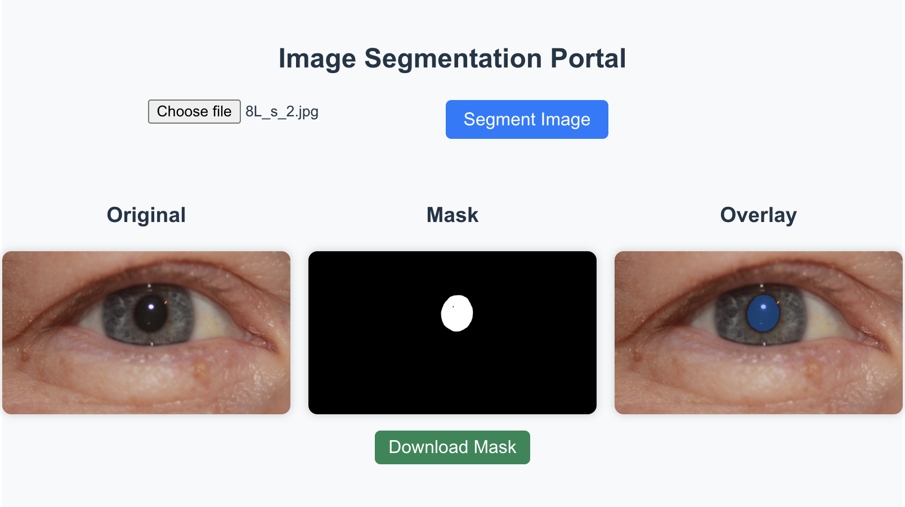

# Eye Segment - Frontend

A modular React UI for image segmentation: upload an image, call a backend `/segment`, and show Original/Mask/Overlay.

## Preview



## Design Architecture


- Frontend: React  
- Backend: Flask  
- Model: Hugging Face Segment Anything Model (SAM)  
- Data Flow:  
  - React frontend uploads an image  
  - Flask backend receives the image via POST `/segment`  
  - SAM model performs segmentation and predicts mask  
  - The mask (Base64 JSON) is returned to the frontend for display  

## Features

### ✨ Key Features

- **Image Upload**: Upload an image easily using a file picker, with an instant preview of the selected image.  
- **Image Segmentation**: Click **Segment Image** to run the segmentation model and generate a mask.  
- **Overlay View**: See the segmentation result directly on top of the original image, and toggle the overlay on or off.  
- **Mask Download**: Download the generated mask as a PNG file after segmentation is complete.  

## Structure
```
src/
  App.jsx
  App.css
  main.jsx
  index.css
  components/
    ImagePicker.jsx
    SegmentationControls.jsx
    PreviewPanel.jsx
    OriginalView.jsx
    MaskView.jsx
    OverlayView.jsx
    Spinner.jsx
  hooks/
    useSegmentation.js
    useOverlay.js
  services/
    apiClient.js
  utils/
    canvas.js
```

## Backend on Colab

Due to Apple Silicon (M1/M2) compatibility/performance limits for some float64 ops and model kernels, running the segmentation backend locally on macOS may be difficult or slow. To ensure GPU availability and reproducible performance, the backend is hosted on Google Colab and exposed via a public tunnel (e.g., ngrok).

How to use it with this frontend:
- Start the Flask/FastAPI backend on Colab and expose endpoints like `/segment`.
- Obtain a public URL (e.g., `https://<your>.ngrok-free.dev`).
- In `frontend/eye-segment/.env.local` set:
  `VITE_BACKEND_URL=https://<your>.ngrok-free.dev`
- Restart the frontend dev server. The UI will call `${VITE_BACKEND_URL}/segment` with `multipart/form-data` field `image` and expect a JSON array containing a base64 `mask`.

## Quick start

1) Install
```bash
cd frontend/eye-segment
npm install
```
2) Configure backend URL in `.env.local`
```
VITE_BACKEND_URL=http://127.0.0.1:5000
# or your ngrok URL
# VITE_BACKEND_URL=https://<your-ngrok>.ngrok-free.dev
```
3) Run
```bash
npm run dev
```
